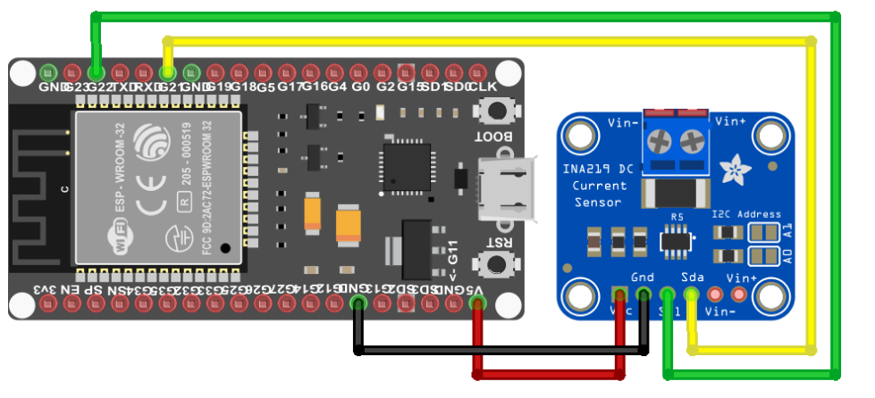
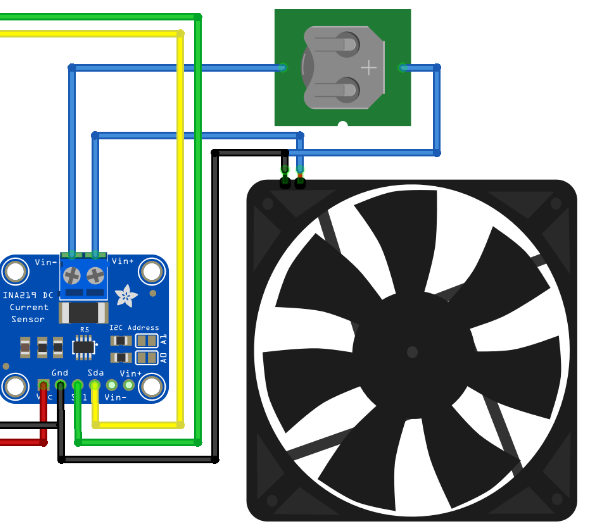

---
hide:
  - navigation
---  

#Oscilloscope

This is a board dedicated to measure current and power of a circuit using INA219, capable of transferring information to a Telegraf instance or via MQTT. I did it to probe other board power consumption in battery powered mode.

##Features

- Measuring current, voltage, power
- Configurable sampling interval 
- Configurable number of samples to average per interval
- Capable of transfer information to other reporting system via UDP using telegraf/influxdb

Measurement Voltage	0V...26V
Max Current	3.2A
Max Power	83W
Operation Voltage	3V...5.5V
Communication Protocol	I2C

##Bill of Material

- 1 [INA219 breakout board](https://it.aliexpress.com/item/1005001636648121.html?_randl_currency=EUR&_randl_shipto=IT&src=google&src=google&albch=shopping&acnt=631-313-3945&slnk=&plac=&mtctp=&albbt=Google_7_shopping&albagn=888888&isSmbActive=false&isSmbAutoCall=false&needSmbHouyi=false&albcp=15227475790&albag=129989760135&trgt=295988246616&crea=it1005001636648121&netw=u&device=c&albpg=295988246616&albpd=it1005001636648121&gclid=CjwKCAiAprGRBhBgEiwANJEY7CEH4F93zjJuso7mPsIiMDksqkgVWJ3XkpnOwNQi1BoqJuPTu2BkWhoCQ5EQAvD_BwE&gclsrc=aw.ds&aff_fcid=6af9e4ff550e4d83a24f6555c830d339-1647082489716-01285-UneMJZVf&aff_fsk=UneMJZVf&aff_platform=aaf&sk=UneMJZVf&aff_trace_key=6af9e4ff550e4d83a24f6555c830d339-1647082489716-01285-UneMJZVf&terminal_id=676d2c3560864e039f8e8255ccf6e8cf&afSmartRedirect=y)
- [breadboard and wires](https://it.aliexpress.com/item/4000805673115.html?spm=a2g0o.productlist.0.0.13c056a4HYIA1P&algo_pvid=3b89dd30-2e62-4c5e-9f47-a3d1ba448ff9&aem_p4p_detail=20220116111751259270886284480019365032&algo_exp_id=3b89dd30-2e62-4c5e-9f47-a3d1ba448ff9-14&pdp_ext_f=%7B%22sku_id%22%3A%2210000008092850406%22%7D&pdp_pi=-1%3B0.87%3B-1%3BEUR+0.59%40salePrice%3BEUR%3Bsearch-mainSearch)

##Assembling

- Wire your ESP32 to breadboard GND and 3V3
- Wire your INA219 as per the table

| ESP32        | INA219          |
| ----------- | ----------- |
| GND       | GND      |
| 5V       | VCC      |
| 27       | SCL      |
| 26       | SDA      |

- Wire your load to be measured to VIN+ and VIN- as per the figure

##Code

The configuration code, other than `main\main.c` is contained in `components\grownode\boards\oscilloscope.c`. The code is meant to be basic in order to give you some training to basic features.

### The Main

You just need to 'load' the board into the firmware

- add an `include "oscilloscope.h"` directive on the header declarations
- change the configuration row from the standard `gn_configure_blink(node)` to `gn_configure_oscilloscope(node)` 

This will tell the compiler to load the easypot1 code into the firmware upon the next build.

### Playing with code

See the [INA219 leaf reference doc](resources/leaves_list/ina219) to understand how to configure and play with parameters

### Creating a full monitoring system

TODO

### Final Result

Here's a quick demo I did while testing:

<iframe width="560" height="315" src="https://www.youtube.com/embed/EDo6dCnkoFY" title="YouTube video player" frameborder="0" allow="accelerometer; autoplay; clipboard-write; encrypted-media; gyroscope; picture-in-picture" allowfullscreen></iframe>
