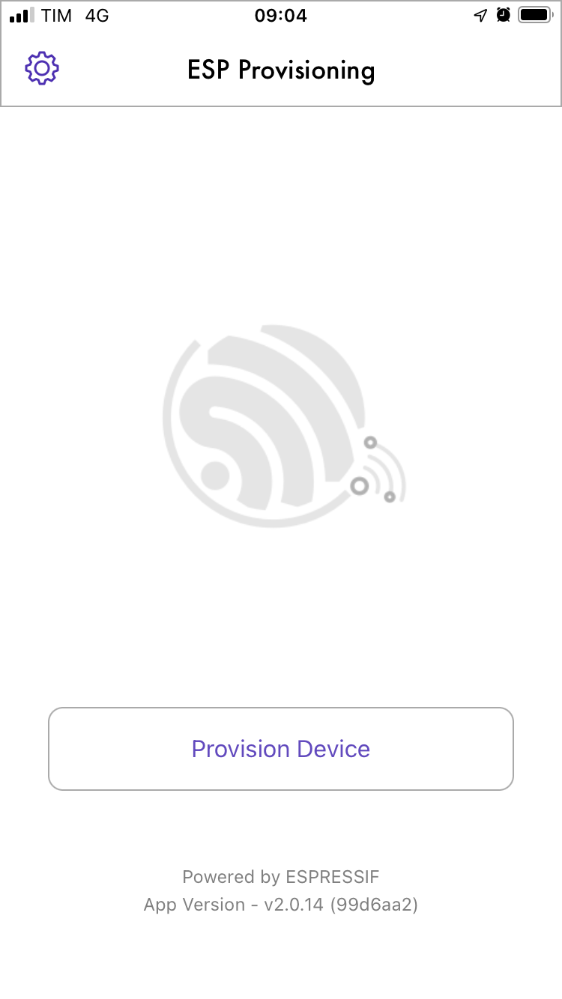
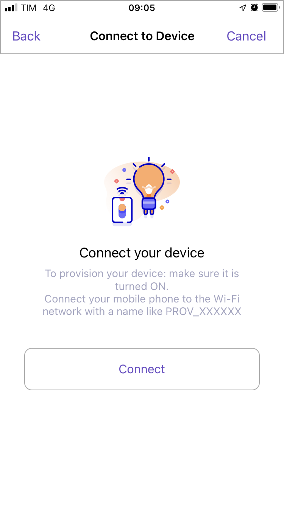

# Getting Started

This page describe the steps needed to have a working development environment on your PC. 

## Set up your environment

### ESP-IDF

> [ESP-IDF](https://www.espressif.com/en/products/sdks/esp-idf) is the development environment provided by the ESP32 chipmaker. It lets you design application using the full chipset capabilities. I've decided to use it instead of higher level solutions like Arduino in order to achieve maximum flexibility and control.

 - install ESP-IDF as per [ESP-IDF getting started guide](https://docs.espressif.com/projects/esp-idf/en/latest/esp32/get-started/)
 
 > Note: actual grownode library is made over esp-idf release 4.4. make sure to download the appropriate version
 
 - install ESP_IDF-LIB as per [ESP-IDF Components library](https://github.com/UncleRus/esp-idf-lib) in the same root folder of ESP-IDF
 - you should have then a folder structure like:
 
```
     root folder
     +--esp-idf
     +--esp-idf-lib
```

### IDE

 - Latest Windows ESP-IDF installation are including an Eclipse development environment that is already configured to run an ESP-IDF project. 
 - If you want to install your own IDE, prepare your favorite development environment (Anyway, I am personally using [eclipse](https://www.eclipse.org/downloads/) with [ESP-IDF plugin](https://github.com/espressif/idf-eclipse-plugin/blob/master/README.md). You should install the 'eclipse for c/c++ developers'

## Obtain GrowNode

 - Open an IDF shell (in Windows you should find in in your windows start menu - it is called ESP-IDF 4.4 CMD), change dir where you want to install grownode

  > Note: if you have installed Eclipse, I recommend to start a new workspace, then open a shell to the workspace directory

 - Clone GrowNode repository using [GIT](https://git-scm.com/) command `git clone --recurse-submodules https://github.com/ogghst/grownode.git`

  > Note: if you have installed Eclipse, you can now import the project using `Import projects.. -> Espressif -> Existing IDF project` and select the grownode directory created with `git clone` command

## Check everything works

### Via ESP-IDF command prompt

 - Open an IDF shell (you should find in in your windows start menu - it is called ESP-IDF 4.4 CMD), change dir where you have downloaded grownode git folder, run `idf.py build`. It will compile for few minutes. 
 
   > Note: in Eclipse, select an esp32 target and build the grownode project
 
 - If everything runs well, you should see something like `Project build complete`
 - Plug your ESP32 into your USB port, take note of the COM port you are attached, and run `idf.py -p (PORT) flash`

### Via Eclipse IDE

- Open Eclipse IDE
- Import the project you have downloaded using `Project -> Import -> Existing IDF Project`
- Press Ctrl+B to build the project
- If everything runs well, you should see something like `Project build complete`
- Plug your ESP32 into your USB port, create a new launch target with the COM port of the board, and run using Ctrl + F11


With default installation, you will see something like:

```
...
I (0) cpu_start: App cpu up.
I (141) cpu_start: Pro cpu start user code
I (141) cpu_start: cpu freq: 160000000
I (141) cpu_start: Application information:
I (146) cpu_start: Project name:     grownode
I (151) cpu_start: App version:      v0.3.0-21-g3184a68-dirty
I (157) cpu_start: Compile time:     Jan  9 2022 08:53:43
I (163) cpu_start: ELF file SHA256:  b0acca75d147e901...
I (169) cpu_start: ESP-IDF:          v4.4-beta1-275-g214d62b9ad
I (176) heap_init: Initializing. RAM available for dynamic allocation:
I (183) heap_init: At 3FFAE6E0 len 00001920 (6 KiB): DRAM
I (189) heap_init: At 3FFB2D90 len 0002D270 (180 KiB): DRAM
I (196) heap_init: At 3FFE0440 len 00003AE0 (14 KiB): D/IRAM
I (202) heap_init: At 3FFE4350 len 0001BCB0 (111 KiB): D/IRAM
I (208) heap_init: At 4008C058 len 00013FA8 (79 KiB): IRAM
I (216) spi_flash: detected chip: generic
I (219) spi_flash: flash io: dio
I (224) cpu_start: Starting scheduler on PRO CPU.
I (0) cpu_start: Starting scheduler on APP CPU.
I (254) grownode: grownode startup sequence completed!
I (264) grownode: _gn_start_leaf blink
I (364) grownode: _gn_start_leaf blink completed
I (5264) gn_blink: blinking - 0
I (10264) gn_blink: blinking - 1
...
```

## Network Startup

If you want to add network connectivity to your board, you need to input the wifi credentials into your board. This process is called provisioning.

First you need to modify your `sdkconfig` file via the command `idf.py menuconfig` and select under Grownode component the `enable networking` checkbox. 
Then it's time to configure the network parameters. Modify the `main.c` file with your MQTT server address:

```
	gn_config_init_param_t config_init = {
		...
		.server_url = "mqtt://grownode",
		...
	};
```

Then you need to recompile and flash again the board to upload the firmware with network capabilities.

Once the new firmware is uploadeed, you will see in the console:

```
...
I (558) wifi:wifi driver task: 3ffc2d98, prio:23, stack:6656, core=0
I (558) system_api: Base MAC address is not set
I (558) system_api: read default base MAC address from EFUSE
I (568) wifi:wifi firmware version: 5c3d3bf
I (568) wifi:wifi certification version: v7.0
I (568) wifi:config NVS flash: enabled
I (568) wifi:config nano formating: disabled
I (578) wifi:Init data frame dynamic rx buffer num: 32
I (578) wifi:Init management frame dynamic rx buffer num: 32
I (588) wifi:Init management short buffer num: 32
I (588) wifi:Init dynamic tx buffer num: 32
I (598) wifi:Init static rx buffer size: 1600
I (598) wifi:Init static rx buffer num: 10
I (598) wifi:Init dynamic rx buffer num: 32
I (608) wifi_init: rx ba win: 6
I (608) wifi_init: tcpip mbox: 32
I (618) wifi_init: udp mbox: 6
I (618) wifi_init: tcp mbox: 6
I (618) wifi_init: tcp tx win: 5744
I (628) wifi_init: tcp rx win: 5744
I (628) wifi_init: tcp mss: 1440
I (638) wifi_init: WiFi IRAM OP enabled
I (638) wifi_init: WiFi RX IRAM OP enabled
I (648) gn_network: Starting provisioning
I (648) phy_init: phy_version 4670,719f9f6,Feb 18 2021,17:07:07
I (758) wifi:mode : sta (84:cc:a8:5e:60:48)
I (758) wifi:enable tsf
I (758) wifi:mode : sta (84:cc:a8:5e:60:48) + softAP (84:cc:a8:5e:60:49)
I (768) wifi:Total power save buffer number: 16
I (768) wifi:Init max length of beacon: 752/752
I (768) wifi:Init max length of beacon: 752/752
I (778) wifi:Total power save buffer number: 16
W (778) wifi_prov_scheme_softap: Error adding mDNS service! Check if mDNS is running
I (788) wifi_prov_mgr: Provisioning started with service name : GROWNODE_5E6048 
I (788) gn_network: Provisioning Started
...
```

Now, you need to download the app:

Android: [Google PlayStore](https://play.google.com/store/apps/details?id=com.espressif.provsoftap)
iOS: [Apple App Store](https://apps.apple.com/in/app/esp-softap-provisioning/id1474040630)

Follow these steps on the Phone apps:
 
- Click on "Provision Device" 




- Click on the "I don't have a QR code" button. Tap on "Connect" and connect to your ESP32's SoftAP Process


- Select the wifi network that the board has temporarily created. As default this is GROWNODE_XXXX where XXXX is a subset of the board MAC address. The app will then show you the visible wifi network to the board, just select your network and put the password



- As proof of possession, default is 'grownode'. you can configure it in 'main' application


- if the password is OK you will see this screen


the board console will show something like:


```
...
I (115448) gn_network: Provisioning OK
I (116318) gn_network: Initializing SNTP. Using the SNTP server: pool.ntp.org
I (116318) gn_mqtt_protocol: Connecting MQTT server at mqtt://grownode
I (117368) gn_mqtt_protocol: MQTT client handshake successful
I (117368) grownode: grownode startup sequence completed!
I (117388) grownode: _gn_start_leaf blink
I (117488) grownode: _gn_start_leaf blink completed
I (122388) gn_blink: blinking - 1
I (127388) gn_blink: blinking - 0
I (132388) gn_blink: blinking - 1
...
```

That's it! you're online!
